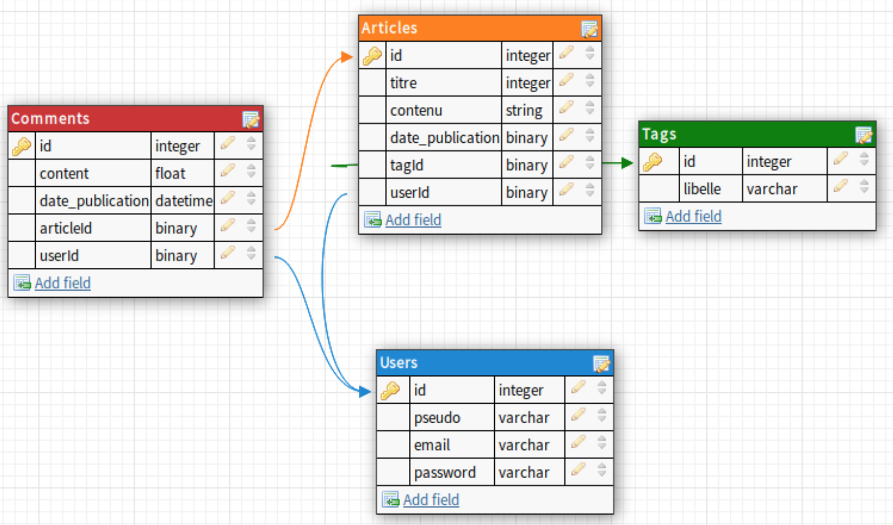

# aSimplePhalconProject

Simple Database management project using Phalcon.
A login functionality using Phalcon native CRSF tokens is implemented.


# Configuration 

## Overview of the data



## Database

To use the website, the database script located in **database-sample/blog.sql** must be run in the database.
The database name is by default "phalcon". It can be modified in the app/config/config.php file

```
return new \Phalcon\Config([
    'database' => [
        'adapter'     => 'Mysql',
        'host'        => 'localhost',
        'username'    => 'root',
        'password'    => 'root',
        'dbname'      => 'phalcon',
        'charset'     => 'utf8',
    ],
...
])
```
